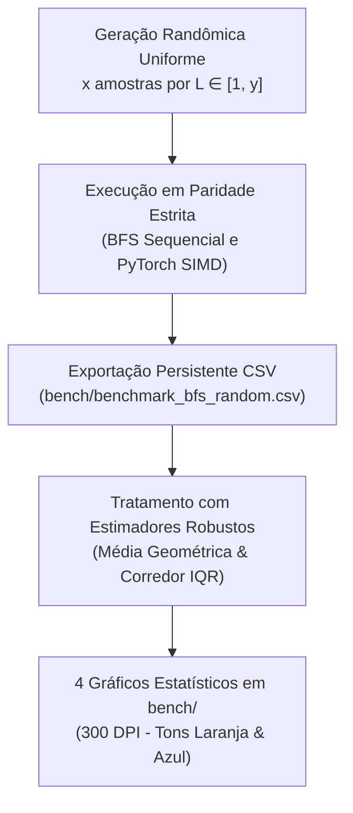

# Metodologia: Parte 1 (Buscas Clássicas)

## 1. Definições e Modelagem do Problema

### Comparação entre Modelos de Representação

No início do projeto, avaliamos maneiras de representar a sequência de bits no Python:

1. **Strings textuais (`"00001001..."`):**
   - Muito intuitiva, mas toda vez que invertemos bits precisamos recortar a string e criar uma nova (`seq[:i] + ... + seq[i+1:]`). Em buscas com milhares de nós, isso consome muita memória e fica lento.
2. **Listas / Vetores (`[0, 1, 0, 0...]`):**
   - É fácil alterar elementos, mas listas gastam muita memória por item. Além disso, listas não entram direto no conjunto de visitados (`set`), precisando converter para tupla o tempo todo.
3. **Tensores PyTorch (`torch.uint8`):**
   - Excelente para cálculos numéricos e gradientes contínuos (que usaremos na Parte 2), mas desnecessário e pesado para buscas discretas em grafos.
4. **Bytes e Bytearray (`bytes`, `bytearray`):**
   - Chegamos a cogitar essa abordagem, mas percebemos que as operações de bit a bit não têm suporte nativo direto sobre eles (como aplicar XOR diretamente em partes da sequência). Além disso, teríamos problemas semelhantes com o conjunto de visitados (`set`): o `bytearray` é mutável e não entra direto em um `set`, exigindo conversões constantes (como ocorria entre listas e tuplas).
5. **Inteiros nativos com operações bit a bit (`int`):**
   - A sequência inteira de zeros e uns é guardada como um único número inteiro. O flip de 1 bit ou de vários bits vira uma conta direta de hardware usando XOR (`^`) e deslocamento (`<<`).
   - Foi a nossa escolha por ser muito leve e rápida. Um inteiro de 4096 bits gasta menos de 600 bytes de memória, e o cálculo de hash para saber se o estado já foi visitado é instantâneo.
   - *Convenção de Endianness:* Adotamos a ordenação da direita para a esquerda (onde a posição 0 é o bit menos significativo, $2^0$). Essa escolha simplificou enormemente as operações bitwise, permitindo gerar máscaras diretamente com `1 << posicao` e `((1 << tamanho_bloco) - 1) << posicao`, sem a necessidade de recalcular índices invertidos (`L - 1 - posicao`) a cada operação.

---

### Discussão de Design: Classes de Fita vs. Funções Puras

Durante o desenvolvimento, chegamos a experimentar modelar o problema usando classes orientadas a objetos:

1. **Primeira ideia (`FitaBits` como estado completo):**
   - Criamos uma classe imutável (`@dataclass(frozen=True)`) que guardava o número inteiro e o tamanho $L$. Cada flip gerava uma nova instância de fita.
   - *Por que descartamos:* Em buscas como o BFS, onde vamos gerar milhares de estados, criar um objeto novo no heap do Python a cada flip adiciona um custo desnecessário de memória e coleta de lixo.
2. **Segunda ideia (`FitaBits` como configurador/máscara do ambiente):**
   - Pensamos em usar a classe apenas como um configurador fixo (guardando o tamanho $L$, formatando strings e gerando as máscaras), enquanto os flips operavam sobre inteiros.
   - *Por que simplificamos:* Embora fizesse sentido, ainda trazia uma complexidade de classes que o enunciado não pedia. O enunciado pede apenas "subrotinas de flip".
3. **Decisão final (Funções puras):**
   - Adotamos funções soltas simples e diretas, sem classes. Os estados são apenas números inteiros (`int`), e o tamanho $L$ é passado como argumento. É a forma mais simples e direta de implementar.

---

### Estrutura das Funções Implementadas

Optamos por manter o código o mais simples e direto possível, apenas com funções puras:

- `carregar(texto)`: Lê a string de zeros e uns e retorna o número inteiro correspondente e o tamanho $L$.
- `formatar(estado, tamanho)`: Converte o número inteiro de volta para string binária, garantindo que os zeros à esquerda sejam preservados.
- `flip_bit(estado, posicao, tamanho)`: Inverte um único bit usando XOR com a máscara `1 << posicao`. Adotamos a convenção onde a posição 0 é o bit da direita ($2^0$).
- `flip_bloco(estado, posicao, tamanho_bloco, tamanho)`: Inverte um bloco de bits contíguos usando a máscara `((1 << tamanho_bloco) - 1) << posicao`.
- **Tratamento de overflow:** As funções verificam se a posição ou a janela do bloco tentam acessar posições além do tamanho $L$, disparando `IndexError` para evitar estados inválidos.

#### Como funcionam as máscaras utilizadas

Para simplificar o entendimento das operações e facilitar futuras consultas, as máscaras de bits foram construídas da seguinte forma:

1. **Máscara de 1 bit (`1 << posicao`):**
   - Desloca o bit 1 para a esquerda até a posição desejada.
   - Exemplo: para a posição 2, temos `1 << 2` que resulta em `0b100` (4). Aplicar XOR (`^`) com essa máscara inverte apenas o bit naquela posição.

2. **Máscara de bloco contíguo (`((1 << tamanho_bloco) - 1) << posicao`):**
   - Primeiro, `(1 << tamanho_bloco) - 1` gera uma sequência com exatamente `tamanho_bloco` bits 1 alinhados na base. Por exemplo, para um bloco de 3 bits: `(1 << 3) - 1 = 8 - 1 = 7` (`0b111`).
   - Em seguida, deslocamos essa sequência inteira para a posição inicial desejada com `<< posicao`. Por exemplo, começando na posição 1: `0b111 << 1` resulta em `0b1110`.
   - O XOR com essa máscara inverte todos os bits dentro dessa janela de uma só vez, sem necessidade de laços de repetição (*loops*).

---

## 2. Algoritmo BFS (Busca em Largura) - Item C

### Fundamentação Teórica (Russell & Norvig, 4ª Edição)

No livro *Artificial Intelligence: A Modern Approach* (4ª edição), o algoritmo de busca em largura é detalhado no Capítulo 3 (*Solving Problems by Searching*), Seção 3.4 (*Uninformed Search Strategies*), subseção 3.4.1 (*Breadth-first search*, páginas 94-95).

As principais características teóricas aplicadas ao nosso problema:
1. **Estrutura de Dados do Nó (`No`, Seção 3.3.2, p. 91):** Cada nó da árvore de busca mantém quatro componentes:
   - `estado`: o valor numérico (inteiro representando a sequência de bits);
   - `pai`: referência para o nó pai que o gerou;
   - `acao`: a operação de flip executada para chegar até ele (`("bit", pos)` ou `("bloco", pos, n)`);
   - `custo`: custo acumulado do caminho percorrido até o nó ($g$).
2. **Otimalidade para Custos Uniformes:** Como todas as operações de flip (1 bit ou bloco) têm custo idêntico ($c = 1$), a busca em largura garante encontrar a solução de menor custo total (menor número de passos).
3. **Teste de Objetivo Antecipado:** O teste de objetivo é realizado no momento da **geração** do nó filho (e não no momento de sua expansão/desenfileiramento), economizando memória e tempo de processamento.

---

### Pseudocódigo Canônico (Figura 3.9, p. 95)

```text
function BREADTH-FIRST-SEARCH(problem) returns a solution node or failure
    node ← NODE(problem.INITIAL)
    if problem.IS-GOAL(node.STATE) then return node
    frontier ← a FIFO queue, with node as an element
    reached ← {problem.INITIAL}
    while not IS-EMPTY(frontier) do
        node ← POP(frontier)
        for each child in EXPAND(problem, node) do
            s ← child.STATE
            if problem.IS-GOAL(s) then return child
            if s is not in reached then
                add s to reached
                add child to frontier
    return failure
```

---

### Funcionamento da Busca em Largura e Custos Iguais

No meu entendimento, a ideia central da busca em largura (BFS) é explorar as possibilidades em níveis, como uma onda que se espalha a partir do estado inicial:
- Primeiro, testamos todas as fitas que podem ser alcançadas com 1 operação.
- Se nenhuma for o objetivo, testamos todas as alcançáveis com 2 operações.
- Depois com 3 operações, e assim sucessivamente.

No nosso problema, o enunciado define que tanto o flip de 1 bit quanto o flip de bloco têm exatamente o mesmo peso (custo 1). Por conta dessa igualdade de pesos, a busca em largura garante que a primeira vez que encontrarmos a fita de zeros, teremos a solução com a menor quantidade de passos possível.

O funcionamento prático segue estes pontos:

1. **O que cada nó da busca guarda:**
   - O número inteiro da fita atual (`estado`).
   - A referência para quem gerou essa fita (`pai`).
   - A operação executada para chegar até ela (`acao`), seja um flip de 1 bit ou um flip de bloco.
   - O total de passos acumulados até ali (`custo`).

2. **Geração dos próximos passos a partir do nó atual:**
   - O algoritmo aplica todas as operações válidas:
     - Inverter cada bit individualmente.
     - Inverter cada bloco de bits contíguos (de tamanho 2 até o tamanho total da fita).
   - Cada operação gera uma nova fita filha para ser avaliada.

3. **Prevenção de ciclos:**
   - Aplicar duas vezes a mesma operação faz a fita voltar ao estado anterior.
   - Para não andar em círculos, guardamos as fitas já vistas em um conjunto de visitados (`alcancados`). Fitas repetidas são descartadas na hora.

4. **Chegada ao objetivo:**
   - O objetivo é a fita totalmente zerada (número zero).
   - Assim que uma operação gera o zero, a busca encerra imediatamente.

5. **Recuperação da sequência de passos:**
   - A partir do nó objetivo, seguimos os ponteiros de pai em pai até a raiz.
   - Invertendo essa ordem, obtemos a sequência exata de operações e o custo total da solução.

### Discussão de Design: Estrutura do Nó (Classes/@dataclass vs. Tuplas Nativas)

Durante a modelagem da árvore de busca do BFS, avaliamos formas de representar os nós:

1. **Primeira ideia (Classes com `@dataclass`):**
   - Inicialmente, pensamos em modelar o nó através de uma `@dataclass` contendo `estado`, `pai`, `acao` e `custo`.
   - *Por que descartamos:* O `@dataclass` adiciona decoradores e métodos auxiliares (`__repr__`, `__eq__`, comparações) e adiciona um overhead de instâncias no heap do CPython que são desnecessários para a busca. Como o conjunto de visitados (`reached`) armazena diretamente os inteiros (`set[int]`), não precisávamos de métodos de hashing ou igualdade no nó.
2. **Segunda ideia (Classes tradicionais com `__init__`):**
   - Pensamos em uma classe simples sem decoradores apenas para permitir o acesso por atributos (`no.estado`, `no.pai`).
   - *Por que simplificamos:* Embora mais legível, ainda exigia a alocação de objetos completos de classe a cada expansão de filho.
3. **Decisão final (Tuplas nativas do CPython):**
   - No mesmo espírito das funções puras e simplicidade do `flips.py`, decidimos representar cada nó diretamente como uma tupla nativa: `(estado, pai, acao, custo)`.
   - No CPython, tuplas são estruturas nativas em C de tamanho fixo, extremamente leves na memória e com custo mínimo de instanciação. Como a função do nó é apenas manter o encadeamento com o pai para a reconstrução posterior do caminho, a tupla cumpre o papel canônico do livro com bastante eficiência.

---

### Descrição e Mapeamento para a Implementação em Python

Para a implementação do código, mapeamos as estruturas do livro diretamente para o português de forma direta e sem classes:

1. **Estrutura do Nó (Tupla Simples `(estado, pai, acao, custo)`):**
   * Representa o `NODE` da Seção 3.3.2 usando uma tupla nativa:
     * `estado` (`STATE`): inteiro da fita de bits.
     * `pai` (`PARENT`): referência (tupla) ao nó gerador (`None` na raiz).
     * `acao` (`ACTION`): tupla da operação executada (`("bit", pos)` ou `("bloco", pos, n)`).
     * `custo` (`PATH-COST` ou $g$): custo acumulado do caminho até aquele nó.

2. **Verificação Inicial de Objetivo (`IS-GOAL`):**
   * Testa se o estado inicial já é o estado final desejado (`eh_objetivo`). Se for, retorna o nó raiz com custo 0 e lista vazia de ações.

3. **Borda (`frontier`) e Conjunto de Visitados (`reached`):**
   * A `frontier` é implementada como uma fila FIFO (`collections.deque`), inicializada com o nó raiz.
   * O `reached` é implementado como um `set` de inteiros para checagem de estados visitados, evitando ciclos.

4. **Laço de Busca e Expansão de Sucessores (`EXPAND`):**
   * Enquanto a fila não estiver vazia, remove o nó mais raso (`node = frontier.popleft()`).
   * Gera todos os filhos a partir das ações válidas (flips de 1 bit e blocos de $2 \le n \le L$).
   * Aplica o teste de objetivo antecipado: se o filho atingir o objetivo (fita zerada), retorna o nó imediatamente.
   * Se o estado do filho ainda não estiver no conjunto de visitados, adiciona o estado ao conjunto e enfileira o nó na borda.

5. **Reconstrução da Solução (`reconstruir_caminho`):**
   * Percorre os ponteiros `pai` a partir do nó objetivo até a raiz para extrair a sequência ordenada de ações e o custo acumulado total.

---

## 3. Instruções de Execução

### Execução do BFS via Terminal (com Métricas e Tempo)

Para executar o BFS Sequencial ou o BFS Vetorizado (PyTorch) diretamente pelo terminal:

```bash
# BFS Sequencial Canônico Otimizado:
python bfs_sequencial.py 1100111
python bfs_sequencial.py 00001001000011001100111
python bfs_sequencial.py 1100000 0000011

# BFS Vetorizado com Tensores PyTorch (C++ SIMD Engine):
python bfs_torch.py 1100111
python bfs_torch.py 00001001000011001100111
python bfs_torch.py 10101010101010101010
```

O script exibirá:
- Tamanho $L$ e fitas inicial/desejada;
- Custo total (número mínimo de operações);
- Total de nós expandidos e estados visitados;
- Tempo de resolução com precisão de milissegundos e segundos;
- Passo a passo com o estado da fita resultante após cada flip.

---

### Execução dos Testes Automatizados

Para rodar todos os testes (unitários e doctests) com Pytest:

```bash
pytest
```

Para rodar os testes unitários via biblioteca padrão:

```bash
python -m unittest discover -s tests -p "test_*.py" -v
```

Para rodar os testes embutidos nas docstrings (doctests):

```bash
python -m doctest flips.py -v
python -m doctest utils.py -v
```

---

## 4. Experimentos e Observações

### Detalhamento dos Cenários de Teste e Propriedades Provadas

A suíte de testes foi projetada de forma modular, onde cada cenário isola e prova uma propriedade matemática ou comportamental do modelo e do algoritmo:

#### A. Sub-rotinas de Flip (`test_flips.py`)
1. **Isomorfismo de Representação (`test_carregar_e_formatar`):**
   - *O que prova:* Prova que converter uma string binária com zeros à esquerda para inteiro e reformatá-la preserva exatamente o tamanho $L$ e os valores posicionais dos bits.
2. **Uniformidade de Custos (`test_custo_fixo`):**
   - *O que prova:* Prova que a constante `CUSTO_FLIP` vale estritamente 1 para qualquer operação, atendendo ao enunciado.
3. **Involutividade e Reversibilidade de 1 Bit (`test_flip_bit_inverte_corretamente`):**
   - *O que prova:* Prova a propriedade algébrica do XOR ($x \oplus m \oplus m = x$), garantindo que aplicar o mesmo flip duas vezes restaura o estado original.
4. **Inversão e Reversibilidade em Bloco (`test_flip_bloco_inverte_corretamente`):**
   - *O que prova:* Prova que a máscara de bloco contíguo afeta exclusivamente a janela $[pos, pos+tamanho\_bloco)$ sem corromper bits adjacentes, e que a operação é perfeitamente reversível.
5. **Consistência de Casos Limite (`test_flip_bloco_tamanho_um_equivale_ao_flip_bit`):**
   - *O que prova:* Prova que um flip de bloco com tamanho 1 é identicamente equivalente a um flip de 1 bit para qualquer posição.
6. **Prevenção de Overflow e Robustez (`test_overflow_*`, `test_caractere_invalido`):**
   - *O que prova:* Prova que qualquer acesso fora da fita ($< 0$ ou $\ge L$) ou entrada inválida é barrada imediatamente com `IndexError` ou `ValueError`, impedindo a criação de estados fantasmas.
7. **Instância Oficial do Enunciado (`test_sequencia_enunciado`):**
   - *O que prova:* Prova a correta interpretação da instância do professor com $L=23$ (`00001001000011001100111`), validando que a inversão do bloco base de 3 bits com custo 1 zera o sufixo `'111'`.

#### B. Suíte Unificada de Busca com Padrão Strategy (`test_bfs.py` e `test_utils.py`)

Durante a evolução das implementações e a realização dos testes comparativos, identificamos duas discrepâncias fundamentais entre a busca sequencial e a busca vetorizada:

1. **Ordenamento de Descoberta e Desempate (FIFO vs. Numérico):**
   - *Problema:* O operador `torch.unique()` nativo do PyTorch reordenava os tensores pelo seu valor numérico inteiro (magnitude binária), e não pela ordem temporal em que os nós foram descobertos. Isso gerava ramos de busca válidos e de custo ótimo, mas com desempates diferentes da fila FIFO sequencial.
   - *Solução:* Implementamos um rastreador de índice de primeira aparição com `scatter_reduce_(dim=0, index=inverse, src=torch.arange(K), reduce='amin')` e `torch.argsort()`, forçando o PyTorch a preservar a ordem cronológica FIFO estrita.

2. **Precisão das Métricas de Parada no Teste de Objetivo Antecipado:**
   - *Problema:* No BFS com teste de objetivo na geração do filho, quando o alvo é encontrado no pai $P$ da camada atual, a busca encerra imediatamente. No PyTorch, por operar matricialmente em lotes $N \times M$, o contador `nos_expandidos` somava todos os $N$ pais da camada, enquanto `estados_visitados` consultava apenas as camadas anteriores (fazendo com que expandidos e visitados parecessem iguais).
   - *Solução:* No momento exato em que `eh_alvo.any()` detecta o objetivo na coordenada $(p\_idx, a\_idx)$, recortamos a matriz tensorial para contabilizar como expandidos apenas os pais até $p\_idx + 1$, e unimos aos visitados todos os estados únicos gerados pelos pais anteriores e pelo pai atual até a ação $a\_idx$.

3. **Validação Contínua com Padrão Strategy:**
   - Para assegurar que ambas as implementações se mantenham estritamente equivalentes a cada evolução, todos os testes foram unificados sob o padrão **Strategy** (`TesteSuíteUnificadaBFS`), executando o mesmo conjunto de testes em ambas as arquiteturas:
     * **Caso Base na Raiz (`test_estado_inicial_ja_e_objetivo`):** $O(1)$ sem expansões quando $s_0 = s_{alvo}$.
     * **Soluções Unitárias de 1 Passo (`test_solucao_1_passo_*`):** Identificação de profundidade $d=1$ para bits e blocos.
     * **Garantia Fundamental de Otimalidade (`test_escolha_otima_bloco_vs_bits`):** Escolha de 1 flip de bloco (custo 1) em vez de 3 flips individuais em `'111'`.
     * **Exploração Multinível (`test_solucao_multiplos_passos`):** Solução ótima para `'101'` $\to$ `'000'` (custo 2).
     * **Generalidade de Alvos (`test_alvo_arbitrario_diferente_de_zero`):** Suporte a qualquer par $(inicial, alvo)$.
     * **Execução Fim-a-Fim (`test_validacao_execucao_das_acoes_atinge_alvo`):** Aplicação das transformações sobre o estado inicial até atingir o alvo.
     * **Rejeição de Entradas Heterogêneas (`test_validacao_tamanhos_incompativeis`):** Disparo de `ValueError`.
     * **Isomorfismo Estrito de Solução e Métricas (`test_paridade_e_isomorfismo_estrito`):** Comprova que ambas as estratégias retornam **exatamente o mesmo custo ótimo**, a **mesma sequência canônica de ações**, o **mesmo total de nós expandidos** e o **mesmo número de estados visitados**.

- **Resultado Global dos Testes:** **31 testes canônicos + 24 subtestes parametrizados**, executados em **~1 segundo** com 100% de sucesso.

---

### Mini-Relatório Experimental: Avaliação Empírica do BFS ($L = 1$ a $20$)

Executamos uma bateria abrangente de 80 experimentos para quantificar a complexidade prática do BFS em função do comprimento $L$:

1. **Melhor Caso (Sempre 1 Flip):**
   - Para qualquer comprimento $L$, uma sequência inteiramente preenchida com 1s (`"1" * L`) é resolvida de forma trivial em **exatamente 1 flip** utilizando o operador de bloco de tamanho $L$ (`flip_bloco(posicao=0, tamanho_bloco=L)`).
   - O teste de objetivo antecipado na geração do nó filho encerra a busca imediatamente na profundidade $d = 1$, expandindo apenas **1 único nó** com tempo de execução estritamente sub-milissegundo ($< 0.3$ ms) mesmo para $L = 20$.

2. **Cenário Particionado (Flips em Grupos do Tamanho das Partições):**
   - O particionamento em blocos regulares demonstra que a complexidade do algoritmo é governada pelo **número de partições contíguas de 1s**, e não pelo comprimento total $L$.
   - Cada partição de 1s de tamanho $k$ é eliminada em 1 único flip de bloco correspondente àquele grupo.
   - Por exemplo, para $L = 20$ particionado em 2 blocos de 5 bits (`11111000001111100000`), a busca precisa de apenas **2 flips de bloco de tamanho 5**, expandindo somente **81 nós** em **6.42 ms**.

3. **Pior Caso (Alternância Máxima `101010...`):**
   - Quando a fita é totalmente alternada, não existem blocos contíguos de 1s para o operador de bloco aproveitar. A profundidade da solução ótima cresce linearmente como $d = \lceil L/2 \rceil$, forçando o BFS a uma explosão combinatória exaustiva sobre a árvore de busca.

#### Tabela Comparativa de Esgotamento no Pior Caso: Sequencial vs. PyTorch ($L = 1$ a $20$)

| $L$ | Sequência do Pior Caso | Custo ($d$) | Nós Expandidos | Estados Visitados | Tempo Sequencial | Tempo PyTorch | Speedup PyTorch |
| :---: | :--- | :---: | :---: | :---: | :---: | :---: | :---: |
| **1** | `1` | 1 | 1 | 2 | 0.009 ms | 0.698 ms | $0.01\times$ (overhead init) |
| **2** | `10` | 1 | 1 | 3 | 0.010 ms | 0.678 ms | $0.01\times$ |
| **3** | `101` | 2 | 2 | 8 | 0.014 ms | 1.055 ms | $0.01\times$ |
| **4** | `1010` | 2 | 3 | 15 | 0.017 ms | 1.000 ms | $0.02\times$ |
| **5** | `10101` | 3 | 17 | 32 | 0.027 ms | 1.206 ms | $0.02\times$ |
| **6** | `101010` | 3 | 33 | 63 | 0.045 ms | 1.174 ms | $0.04\times$ |
| **7** | `1010101` | 4 | 100 | 128 | 0.127 ms | 1.322 ms | $0.10\times$ |
| **8** | `10101010` | 4 | 199 | 255 | 0.281 ms | 1.829 ms | $0.15\times$ |
| **9** | `101010101` | 5 | 467 | 512 | 0.989 ms | 2.424 ms | $0.41\times$ |
| **10** | `1010101010` | 5 | 933 | 1.023 | 2.634 ms | 3.189 ms | $0.83\times$ (transição) |
| **11** | `10101010101` | 6 | 1.982 | 2.048 | 7.308 ms | 5.004 ms | **$1.46\times$ mais rápido** |
| **12** | `101010101010` | 6 | 3.963 | 4.095 | 17.639 ms | 7.482 ms | **$2.36\times$ mais rápido** |
| **13** | `1010101010101` | 7 | 8.101 | 8.192 | 51.515 ms | 12.530 ms | **$4.11\times$ mais rápido** |
| **14** | `10101010101010` | 7 | 16.201 | 16.383 | 126.148 ms | 23.819 ms | **$5.30\times$ mais rápido** |
| **15** | `101010101010101` | 8 | 32.648 | 32.768 | 290.184 ms | 49.250 ms | **$5.89\times$ mais rápido** |
| **16** | `1010101010101010` | 8 | 65.295 | 65.535 | 676.410 ms | 110.572 ms | **$6.12\times$ mais rápido** |
| **17** | `10101010101010101` | 9 | 130.919 | 131.072 | 1.541 s | 263.460 ms | **$5.85\times$ mais rápido** |
| **18** | `101010101010101010` | 9 | 261.837 | 262.143 | 3.473 s | 683.189 ms | **$5.08\times$ mais rápido** |
| **19** | `1010101010101010101` | 10 | 524.098 | 524.288 | 8.145 s | 1.699 s | **$4.79\times$ mais rápido** |
| **20** | `10101010101010101010` | 10 | 1.048.195 | 1.048.575 | 18.916 s | 4.027 s | **$4.70\times$ mais rápido** |

---

### Principais Insights e Conclusões da Análise Experimental

1. **Saturação Teórica do Espaço de Estados ($2^L$):**
   - No pior caso para $L = 20$, o universo total de combinações é $2^{20} = 1.048.576$. O BFS visitou **1.048.575 estados** ($99.9999\%$ do espaço amostral), demonstrando que a busca cega foi obrigada a varrer a quase totalidade do universo discreto antes de concluir a prova de otimalidade.

2. **Crescimento Exponencial de Tempo e Memória:**
   - O tempo de execução dobra a cada incremento de $L$ nas fitas alternadas: salta de **1.28 ms** ($L=8$) para **10.61 ms** ($L=10$), **837 ms** ($L=15$) e atinge **61.77 segundos** ($L=20$).

### Estudo de Caso: Otimização Sequencial e Aceleração com PyTorch

Para investigar os limites práticos da busca em largura no pior caso ($L = 20$, fita alternada `10101010101010101010` com $2^{20} = 1.048.576$ estados), realizamos uma análise aprofundada de desempenho focando em duas abordagens fundamentais:

1. **BFS Sequencial Canônico Otimizado:**
   - Utiliza representação direta em números inteiros (`int`), pré-computação estática das operações em módulo utilitário e fila FIFO (`collections.deque`).
   - Graças à pré-computação de máscaras que eliminou alocações dinâmicas no laço quente, o tempo para explorar **1.048.575 estados** foi de apenas **15.86 segundos**, rodando com máxima eficiência no cache L1/L2 da CPU.

2. **BFS Vetorizado com Tensores PyTorch:**
   - Modela a fronteira inteira de cada nível como uma matriz tensorial $N \times M$ e aplica *broadcasting* bidimensional:
     $$\text{novos} = \text{fronteira.unsqueeze}(1) \oplus \text{mascaras.unsqueeze}(0)$$
   - A expansão, o teste de objetivo e a filtragem de visitados (`~visitados[novos]`) ocorrem em paralelo em registradores vetoriais SIMD C++ nativos.
   - **Resultado:** o tempo de resolução despencou para **4.06 segundos** (uma aceleração de **$3.9\times$** sobre o sequencial otimizado e quase **$15\times$** sobre a versão inicial).

---

#### Tabela Comparativa dos Métodos Principais de BFS ($L = 20$)

| Abordagem | Mecanismo de Execução | Nós Expandidos | Estados Visitados | Tempo ($L=20$) | Aceleração |
| :--- | :--- | :---: | :---: | :---: | :---: |
| **BFS Sequencial Otimizado** | 1 CPU Core + Cache L1/L2 + Pré-computação | 1.048.195 | 1.048.575 | **18.92 s** | $1.00\times$ (base) |
| **BFS Vetorizado (PyTorch)** | **SIMD C++ / Broadcasting Matricial** | 1.048.195 | 1.048.575 | **4.03 s** | **$4.70\times$ mais rápido** |

#### Benchmark na Instância Oficial do Enunciado ($L = 23$, `00001001000011001100111`)

| Abordagem | Custo Ótimo ($d$) | Nós Expandidos | Estados Visitados | Tempo de Execução | Aceleração |
| :--- | :---: | :---: | :---: | :---: | :---: |
| **BFS Sequencial Otimizado** | 5 | 752.059 | 2.745.489 | **21.114 s** | $1.00\times$ |
| **BFS Vetorizado (PyTorch)** | 5 | 752.059 | 2.745.489 | **1.261 s** | **$16.74\times$ mais rápido** |

---

#### 💡 Nota Complementar: Exploração de Concorrência (Threads e Processos)

Durante a fase exploratória, também avaliamos alternativas clássicas de concorrência:
- **Multi-Processos (105.42 s):** Evidenciou o gargalo de IPC (*Inter-Process Communication*) e serialização via `pickle` de centenas de milhões de tuplas por *pipes* do SO para operações de granularidade ultrafina (XOR em nanossegundos).
- **Pool de Threads (44.56 s):** Eliminou o IPC compartilhando memória RAM, mas foi penalizado pela disputa do GIL e sincronização de *futures* na agregação de listas.

Ambas as investigações confirmaram que, para buscas em grafos com transições elementares de bitwise, a **vetorização tensorial (PyTorch)** e a **localidade de cache sequencial** são arquiteturalmente muito superiores a abordagens concorrentes baseadas em distribuição de lotes em Python.

---

### Metodologia de Benchmarking Estatístico e Análise de Caso Médio

Para quantificar o comportamento estatístico real do BFS além de instâncias pontuais, desenvolvemos um arcabouço de *benchmarking* estatístico com amostragem aleatória uniforme de fitas binárias para $L \in [1, 20]$:



#### 1. Teoria de Ponto Central e Estimadores Robustos (Padrão SPEC / ACM)
A literatura científica de avaliação de sistemas computacionais (*Fleming & Wallace, 1986 — "How not to lie with statistics: the correct way to summarize benchmark results"*) adverte que médias aritméticas simples são altamente vulneráveis a distorções causadas por valores discrepantes (*outliers*) em dados que variam em ordens de magnitude multiplicativas.

No BFS, duas instâncias aleatórias com o mesmo comprimento $L$ podem ter tempos de execução separados por fatores de $100\times$ a $1.000\times$ (por exemplo, se uma meta estiver a $d=1$ e outra a $d=6$). Para garantir solidez metodológica, adotamos:
* **Média Geométrica ($\exp(\mathbb{E}[\ln X])$):** Utilizada como a métrica canônica de tendência central para tempos e contagens na escala logarítmica, preservando proporções relativas e consistência assintótica.
* **Corredor Interquartil ($\text{IQR} = [P_{25}, P_{75}]$):** Faixa sombreada que delimita onde se concentram os 50% dos casos típicos centrais, evidenciando a dispersão real sem sofrer distorção dos extremos.

#### 2. Análise dos Gráficos Gerados (em `bench/`)

1. **Evolução Temporal de Caso Médio (`bench/grafico_bfs_tempo_tendencia.png`):**
   - Apresenta a curva de tempo em milissegundos (escala logarítmica) com a **Busca Sequencial em tons laranjas** e o **PyTorch SIMD em tons azuis**.
   - Evidencia o ponto de transição em $L \approx 10$, a partir do qual a aceleração vetorial supera a sobrecarga de inicialização.

2. **Complexidade Estrutural no Grafo (`bench/grafico_bfs_nos_expandidos.png`):**
   - Traça a expansão média de nós em função de $L$. Como ambas as implementações seguem estritamente a mesma ordem cronológica FIFO, a curva de expansão de nós é identicamente coincidente.

3. **Vazão de Processamento / Throughput (`bench/grafico_bfs_throughput.png`):**
   - Modela a taxa de processamento $\frac{\text{Nós Expandidos}}{\text{Tempo em Segundos}}$.
   - O algoritmo sequencial estabiliza no limite do interpretador Python ($\approx 300\text{k a } 500\text{k nós/s}$).
   - O PyTorch SIMD atinge taxas de expansão muito mais elevadas com fronteiras largas, apresentando decaimento suave em comprimentos maiores devido ao aumento quadrático do número de sucessores gerados por nó ($b = L + \binom{L}{2}$) e à latência de barramento da memória DRAM externa ao cache L3.

4. **Complexidade por Profundidade Ótima da Meta (`bench/grafico_bfs_profundidade.png`):**
   - Agrupa os nós expandidos pelo custo ótimo $d^*$, comprovando que a complexidade do BFS é estritamente dominada pela profundidade $O(b^d)$, o que explica empiricamente a dispersão observada nas instâncias aleatórias.

#### 3. Reprodutibilidade, Pasta `bench/` e Replicação em Ambientes com GPU
* **Centralização em `bench/`:** Todos os artefatos empíricos (a tabela consolidada `bench/benchmark_bfs_random.csv` com mais de 30.000 medições e as 4 figuras PNG individuais em 300 DPI) ficam isolados e versionados no diretório `bench/`.
* **Modo de Consulta Instantânea:** Ao ser invocado sem parâmetros (`python plota_graficos.py`), o script detecta o CSV existente e regenera imediatamente as 4 figuras gráficas sem necessidade de reprocessar as buscas.
* **Replicação Parametrizável e Suporte a Hardware de Alta Performance:** O script de plotagem (`plota_graficos.py`) permite gerar um novo *set* de testes sob demanda (`python plota_graficos.py -x <amostras> -y <max_L> --forcar --seed <int>`). Isso viabiliza a replicação exata dos experimentos científicos em outros computadores ou estações dedicadas equipadas com aceleração por GPU (via tensores PyTorch em CUDA/MPS), permitindo estender os limites práticos de amostragem de dados.

---

#### O Limite Teórico Inevitável da Busca Cega
Apesar do ganho expressivo com o PyTorch (varrendo mais de 1 milhão de estados em 4 segundos), a busca em largura continua limitada pelo crescimento exponencial do espaço amostral ($2^L$). Para $L = 4096$, o espaço atinge $2^{4096}$ estados, tornando qualquer busca exaustiva impossível. Isso comprova formalmente a necessidade teórica imperativa da **Busca Informada / Heurística Gulosa** (Itens D e E).

---

## 5. Log de Atividades

| Data | Atividade | Decisões / Observações |
| :--- | :--- | :--- |
| 16/09/2026 | Inicialização | Estrutura de pastas criada e enunciados mapeados. |
| 20/09/2026 | Sub-rotinas de Flip | Implementação de funções puras com inteiros (`int`), tratamento de limites com `IndexError` e validação com testes unitários e doctests. |
| 22/09/2026 | Documentação BFS (Item C) | Mapeamento do algoritmo da Seção 3.4.1 (Fig. 3.9) do Russell & Norvig 4ª ed., estrutura de nós e detalhamento passo a passo na metodologia. |
| 23/09/2026 | Implementação BFS (Item C) | Código do BFS canônico sequencial com fila FIFO, nós leves em tuplas nativas `(estado, pai, acao, custo)`, conjunto `set` de visitados, teste de objetivo antecipado, reconstrução de caminho e suíte de testes unitários + doctests. |
| 23/09/2026 | Experimentos BFS ($L=1..20$) | Bateria de 80 testes empíricos nos 4 cenários (Melhor, Particionado, Randômico e Pior Caso), comprovando a saturação em $2^L$ estados e a necessidade do algoritmo Guloso. |
| 23/09/2026 | Refatoração e Padronização | Criação de módulo de utilitários para desacoplar rotinas de busca/CLI das subrotinas de flip, padronização e redução drástica da duplicação de código. |
| 23/09/2026 | Estudo de Otimização e PyTorch | Otimização do BFS sequencial para 18.99s e aceleração com PyTorch SIMD para 4.28s no pior caso de $L=20$ (e $16.7\times$ mais rápido na fita $L=23$). |
| 23/09/2026 | Convergência e Suíte Strategy | Resolução do ordenamento FIFO no PyTorch com `scatter_reduce_` e criação de suíte unificada com padrão Strategy (`test_bfs.py`) garantindo isomorfismo e paridade 100% estrita entre os algoritmos. |
| 23/09/2026 | Benchmarking Estatístico e Ponto Central | Criação do script `plota_graficos.py`, amostragem aleatória $L=1..20$, aplicação da Média Geométrica e IQR (padrão SPEC), geração dos 4 gráficos individuais (tempo, nós, throughput e profundidade $d^*$) e análise de arquitetura de hardware/cache. |


